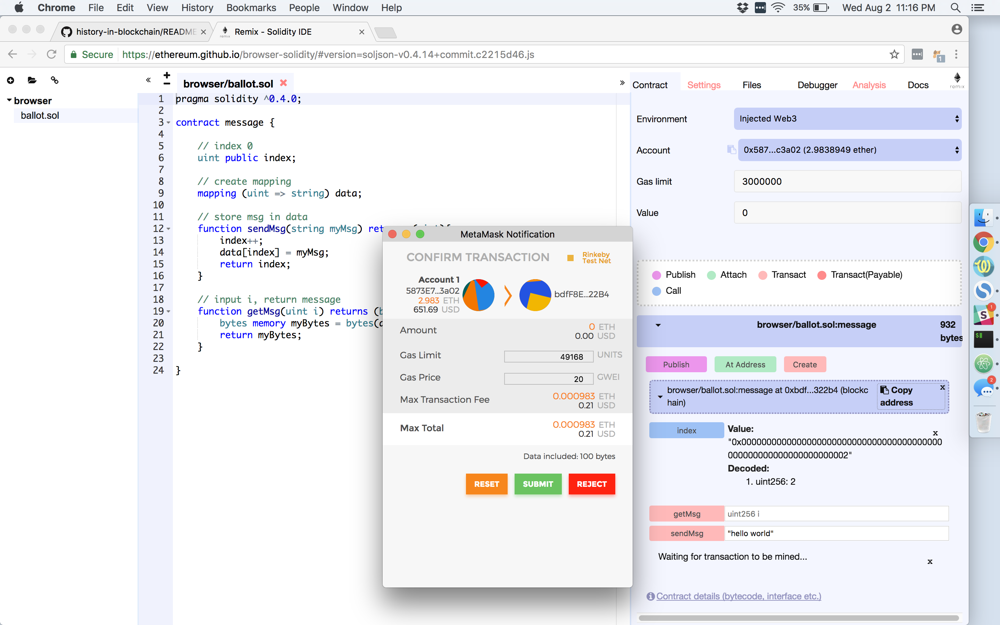

# History onto the Blockchain

The purpose of this repo is to pay a small amount of Ether to save a message onto the blockchain. This message will live on the blockchain indefinitely. This is how history should be recorded.

# How to send info to the blockchain (testnet)
- download metamask: https://chrome.google.com/webstore/detail/metamask/nkbihfbeogaeaoehlefnkodbefgpgknn?hl=en
- go to ethereum IDE: https://ethereum.github.io/browser-solidity
- make sure `Environment: Injected Web3`
- `At Address`
- copy/paste this into the address: 0xbdfF8E485fCdb8f0Ac81A45ad349c44FAA5322B4
- next to `sendMsg` type "this message has to be in double quotes"
- click `sendMsg`
- in Metamask, click `send`
- 

# How to view what you sent
- https://rinkeby.etherscan.io/address/0xbdff8e485fcdb8f0ac81a45ad349c44faa5322b4
- click txHash
- click `Convert To Ascii`
